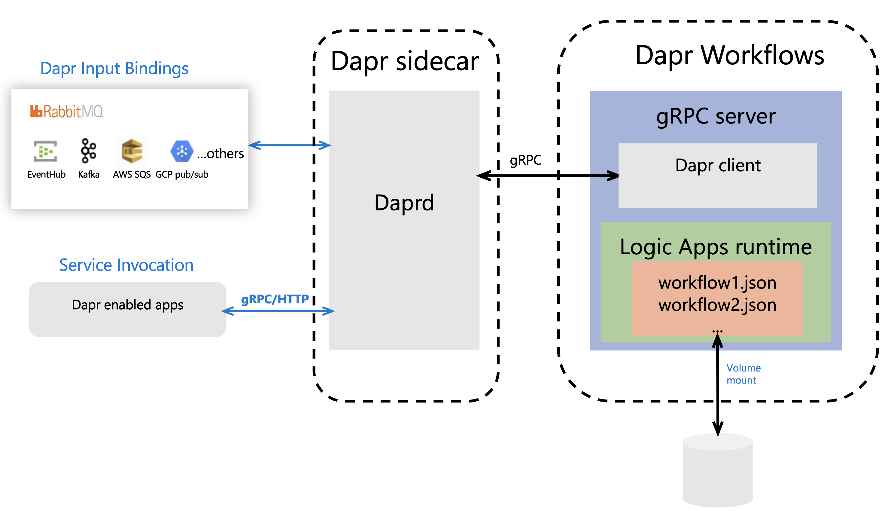

# Dapr Workflows - Run Cloud-Native Workflows using Dapr

Dapr Workflows is a lightweight host that allows developers to run cloud-native workflows locally, on-premises or any cloud environment using the [Azure Logic Apps](https://docs.microsoft.com/en-us/azure/logic-apps/logic-apps-overview) workflow engine and [Dapr](https://github.com/dapr/dapr).

Watch this [video](https://youtu.be/7fP-0Ixmi-w?t=116) for overview of Dapr Workflows. 


[](https://opensource.org/licenses/MIT)

## Contents

- [Benefits](#benefits)
- [How it works](#how-it-works)
- [Example](#example)
- [Get Started](#get-started)
- [Supported workflow features](#supported-workflow-features)
- [Build](#build)

## Benefits

By using a workflow engine, business logic can be defined in a declarative, no-code fashion so application code doesn't need to change when a workflow changes. Dapr Workflows allows you to use workflows in a distributed application along with these added benefits:

* Run workflows anywhere - on your local machine, on-premises, on Kubernetes or in the cloud
* Built-in tracing, metrics and mTLS through Dapr
* gRPC and HTTP endpoints for your workflows
* Kick off workflows based on Dapr bindings events
* Orchestrate complex workflows by calling back to Dapr to save state, publish a message and more

## How it works

>**New to Dapr?**
> Learn more about Dapr with [this overview](https://github.com/dapr/docs/blob/master/overview/README.md)

Dapr Workflows hosts a gRPC server that implements the Dapr Client API.

This allows users to start workflows using gRPC and HTTP endpoints through Dapr, or start a workflow asynchronously using Dapr bindings.
Once a workflow request comes in, Dapr Workflows uses the Logic Apps SDK to execute the workflow.



## Example

Dapr Workflows can be used as the orchestrator for many otherwise complex activities. For example, invoking an external endpoint, saving the data to a state store, publishing the result to a different app or invoking a binding can all be done by calling back into Dapr from the workflow itself.

This is due to the fact Dapr runs as a sidecar next to the workflow host just as if it was any other app.

Examine [workflow2.json](./samples/workflow2.json) as an example of a workflow that does the following:

1. Calls into Azure Functions to get a JSON response
2. Saves the result to a Dapr state store
3. Sends the result to a Dapr binding
4. Returns the result to the caller

Since Dapr supports many pluggable state stores and bindings, the workflow becomes portable between different environments (cloud, edge or on-premises) without the user changing the code - *because there is no code involved*.

## Get Started

Prerequisites:

1. Install the [Dapr CLI](https://github.com/dapr/cli#getting-started)
2. [Azure Blob Storage Account](https://docs.microsoft.com/en-us/azure/storage/blobs/storage-blob-create-account-block-blob?tabs=azure-portal)

**Supported Dapr Version: 0.10.0 and above**

### Self hosted (running locally)

#### Deploy Dapr

Once you have the Dapr CLI installed, run:

```
dapr init
```

#### Invoke Logic Apps using Dapr

First, set up the environment variables containing the Azure Storage Account credentials:

Mac / Linux

```bash
export STORAGE_ACCOUNT_KEY=<YOUR-STORAGE-ACCOUNT-KEY>
export STORAGE_ACCOUNT_NAME=<YOUR-STORAGE-ACCOUNT-NAME>
```

Windows

```bash
set STORAGE_ACCOUNT_KEY=<YOUR-STORAGE-ACCOUNT-KEY>
set STORAGE_ACCOUNT_NAME=<YOUR-STORAGE-ACCOUNT-NAME>
```

```
cd src/Dapr.Workflows

dapr run --app-id workflows --protocol grpc --port 3500 --app-port 50003 -- dotnet run --workflows-path ../../samples

curl http://localhost:3500/v1.0/invoke/workflows/method/workflow1

{"value":"Hello from Logic App workflow running with Dapr!"}                                                                                   
```

Rejoice!

### Kubernetes

Make sure you have a running Kubernetes cluster and `kubectl` in your path.

#### Deploy Dapr

Once you have the Dapr CLI installed, run:

```
dapr init --kubernetes
```

Wait until the Dapr pods have the status `Running`.

#### Create a Config Map for the workflow

```
kubectl create configmap workflows --from-file ./samples/workflow1.json
```

#### Create a secret containing the Azure Storage Account credentials

Replace the account name and key values below with the actual credentials:

```
kubectl create secret generic dapr-workflows --from-literal=accountName=<YOUR-STORAGE-ACCOUNT-NAME> --from-literal=accountKey=<YOUR-STORAGE-ACCOUNT-KEY>
```

#### Deploy Dapr Worfklows

```
kubectl apply -f deploy/deploy.yaml
```

#### Invoke the workflow using Dapr

Create a port-forward to the dapr workflows container:

```
kubectl port-forward deploy/dapr-workflows-host 3500:3500
```

Now, invoke logic apps through Dapr:

```
curl http://localhost:3500/v1.0/invoke/workflows/method/workflow1

{"value":"Hello from Logic App workflow running with Dapr!"}                                                                                   
```

Rejoice once more!

### Invoking workflows using Dapr bindings

First, create any Dapr binding of your choice.

See [this](https://github.com/dapr/docs/tree/master/howto/trigger-app-with-input-binding) How-To tutorial and [sample](https://github.com/dapr/samples/tree/master/5.bindings) to get started.

In order for Dapr Workflows to be able to start a workflow from a Dapr binding event, simply name the binding with the name of the workflow you want it to trigger.
Couldn't get any simpler!

Here's an example of a Kafka binding that will trigger a workflow named `workflow1`:

```yaml
apiVersion: dapr.io/v1alpha1
kind: Component
metadata:
  name: workflow1
spec:
  type: bindings.kafka
  metadata:
  - name: topics
    value: topic1
  - name: brokers
    value: localhost:9092
  - name: consumerGroup
    value: group1
  - name: authRequired
    value: "false"
```

#### Self hosted

Place the binding yaml file above in a `components` directory at the root of your application.

#### Kubernetes

```
kubectl apply -f my_binding.yaml
```

#### Seeing events triggering logic apps

Once an event is sent to the bindings component, check the logs Dapr Workflows to see the output.

In standalone mode, the output will be printed to the local terminal.

On Kubernetes, run the following command:

```
kubectl logs -l app=dapr-workflows-host -c host
```
## Supported workflow features

### Supported Actions and Triggers

* [HTTP](https://docs.microsoft.com/en-us/azure/connectors/connectors-native-http)
* [Schedule](https://docs.microsoft.com/en-us/azure/logic-apps/concepts-schedule-automated-recurring-tasks-workflows)
* [Request / Response](https://docs.microsoft.com/en-us/azure/connectors/connectors-native-reqres)

### Supported Control Workflows

* [All Control Workflows](https://docs.microsoft.com/en-us/azure/connectors/apis-list#control-workflow)

### Supported Data Manipulation

* [All Data Operations](https://docs.microsoft.com/en-us/azure/connectors/apis-list#manage-or-manipulate-data)

### Not supported

* [Managed Connectors](https://docs.microsoft.com/en-us/azure/connectors/apis-list#managed-connectors)

## Build

Make sure you have dotnet core installed on your machine. At minimum, you need [.NET Core SDK 3.1](https://dotnet.microsoft.com/download/dotnet-core/3.1) to build.

1. Clone the repo
2. Inside the top level dir, run: `dotnet build`

### Build Docker Image

Make sure you have Docker installed on your machine.

Compile to release mode:

```
dotnet publish -c Release -r linux-x64 --self-contained false
```

Build image:

```
docker build -t <registry>/<image> .
```

Push image:

```
docker push <registry>/<image>
```
